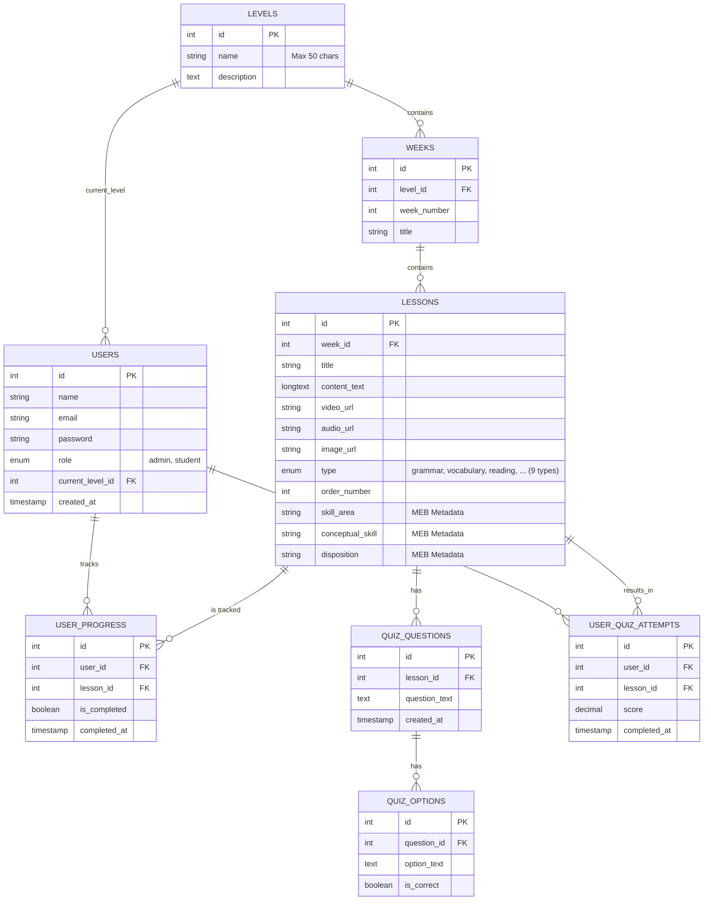

# E-R Diyagramı (Mermaid)

```mermaid
erDiagram
    LEVELS ||--o{ USERS : "current_level"
    LEVELS ||--o{ WEEKS : "contains"
    WEEKS ||--o{ LESSONS : "contains"
    USERS ||--o{ USER_PROGRESS : "tracks"
    LESSONS ||--o{ USER_PROGRESS : "is tracked"
    LESSONS ||--o{ QUIZ_QUESTIONS : "has"
    QUIZ_QUESTIONS ||--o{ QUIZ_OPTIONS : "has"
    USERS ||--o{ USER_QUIZ_ATTEMPTS : "performs"
    LESSONS ||--o{ USER_QUIZ_ATTEMPTS : "results_in"

    USERS {
        int id PK
        string name
        string email
        string password
        enum role "admin, student"
        int current_level_id FK
        timestamp created_at
    }

    LEVELS {
        int id PK
        string name "Max 50 chars"
        text description
    }

    WEEKS {
        int id PK
        int level_id FK
        int week_number
        string title
    }

    LESSONS {
        int id PK
        int week_id FK
        string title
        longtext content_text
        string video_url
        string audio_url
        string image_url
        enum type "grammar, vocabulary, reading, ... (9 types)"
        int order_number
        string skill_area "MEB Metadata"
        string conceptual_skill "MEB Metadata"
        string disposition "MEB Metadata"
    }

    QUIZ_QUESTIONS {
        int id PK
        int lesson_id FK
        text question_text
        timestamp created_at
    }

    QUIZ_OPTIONS {
        int id PK
        int question_id FK
        text option_text
        boolean is_correct
    }

    USER_QUIZ_ATTEMPTS {
        int id PK
        int user_id FK
        int lesson_id FK
        decimal score
        timestamp completed_at
    }

    USER_PROGRESS {
        int id PK
        int user_id FK
        int lesson_id FK
        boolean is_completed
        timestamp completed_at
    }
```
